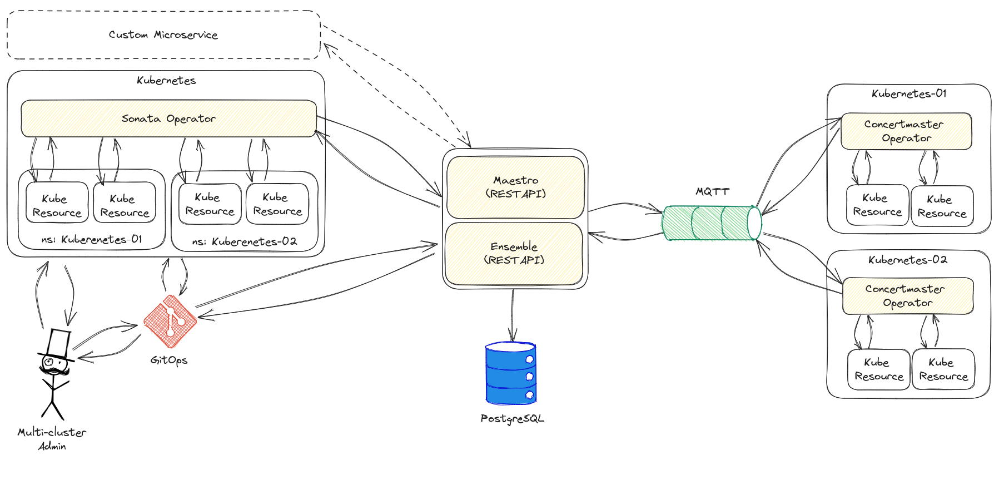

# ConcertMaster

ConcertMaster is a component of the Kube Orchestra Project, a multi-cluster resources orchestrator for Kubernetes.

ConcertMaster is in-cluster Operator that lifecycles the resource definitions coming from the MQTT topics. It also propagates back into MQTT the state of all resources lifecycled.

## Kube Orchestra Architecture



## MQTT Message Flow

### General

#### contentType

- All concertmaster MQTT messages MUST set the `concentType` MQTT property
- `contentType` is defined as `v<content-encoding-version>/<data-interchange-format>(+compression)`
- `contentType` MUST always include the content-encoding-version and the data-interchange-format.
- `contentType` MAY include an optional compression section to indicate the message payload needs to be uncompressed before parsing the data-interchange-format.
- examples: `v1/json`, `v3/protobuf`, `v1/json+gzip`

### v1/json

#### Resource Messages

Resource messages instruct clients to reconcile objects on the target.\
Clients subscribe to the MQTT Topic `/v1/<client-id>/+/content` to receive Resource Messages for themselves.

Server implementations MAY choose to MQTT RETAIN resource messages in the topic to allow clients to resync all state on startup.

**MQTT Payload Example**
```js
{
  // Unix Timestamp (UTC) at which time
  // the message was sent to the broker.
  "sentTimestamp": 1680964785,

  // Server-side opaque corelation ID.
  // MUST be passed back in status responses unchanged.
  "resourceGenerationID": "12345",

  // Kubernetes Manifest to apply on the target.
  "content": {
    // MUST Group Version Kind/TypeMeta
    "apiVersion": "apps/v1",
    "kind": "Deployment",

    "metadata": {
      // MUST server generated UID
      // See delete flow.
      "uid":"cc0fe9c4-681b-48d3-a10b-672b27c7115e",
      // MUST object name
      "name": "test",
      // MAY (MUST if cluster-scoped resource) namespace
      "namespace":"default",
      // MUST server generation
      "generation": 12,

      // MAY indicate requested object deletion.
      // RFC3339 Timestamp.
      // See delete flow.
      "deletionTimestamp": ""
    },

    "spec": {} //...
  }
}
```

#### Status Messages

Status messages publish status information about reconciled objects on the target.\
Clients publish to the MQTT Topic `/v1/<client-id>/<obj-uid>/status` to publish status messages.

Client implementations MAY choose to MQTT RETAIN status messages in the topic to allow the server resync status.

**JSON Payload Example**
```js
{
  // Unix Timestamp (UTC) at which time
  // the message was sent to the broker.
  "sentTimestamp": 1680964785,

  // Server-side opaque corelation ID.
  // MUST be passed back in status responses unchanged.
  "resourceGenerationID": "12345",

  // agent status information.
  "reconcileStatus" {
    // MAY when object exists/
    // Object generation as observed on the target.
    // .metadata.generation
    "observedGeneration": 1234,

    // MAY when object exists.
    // RFC3339 Timestamp.
    // .metadata.creationTimestamp as observed on the target.
    "creationTimestamp": "",

    // Kubernetes style status conditions,
    // describing the state of the object on the target.
    "conditions": [
      {
        "type": "Reconciled",
        "status": "False",
        "reason": "CreateFailed",
        "message": "Cant create apps/v1 deployment without .namespace"
      }
    ]
  },

  // content status as observed on the target.
  "contentStatus": {},
}
```

#### Delete Flow

The server can request the deletion of objects by setting the `deletionTimestamp` in the `content` payload. \
Clients receiving object instructions with `deletionTimestamp` set MUST in turn delete the object on cluster.

When the object can no longer be observed, the client is publishing a last Status Message with the `Deleted` condition set to `True`.

Servers observing a Status Message with the `Deleted` condition set to `True` and MQTT RETAIN MUST clear the retained message after processing the deletion on the server side.

Servers using MQTT RETAIN MUST clear the retained Resource Message associated with the Status Message after deletion has been processed.

Clients MUST wait for finalizers on the target to clear, before reporting `Deleted == True`.

Clients MAY send intermediate deletion Status Messages indicating the state of the delete operation.

## Testing

```
con -p 31320 -u admin --password=password
pub -t /my-cluster/default:test123/spec -q1 -m '{"apiVersion":"v1","kind":"ConfigMap","metadata":{"name":"test123","namespace":"default","labels":{"test":"123"}}}'
pub -t /my-cluster/default:test123/spec -q1 -m '{"apiVersion":"v1","kind":"ConfigMap","metadata":{"name":"test123","namespace":"default","deletionTimestamp":"2023-04-07T14:50:44Z"}}'

pub -t /my-cluster/default:test123/spec -q1 -m '{"apiVersion":"apps/v1","kind":"Deployment","metadata":{"name":"nginx-deployment","namespace":"default","uid":"5ba4ccba-da00-4b4f-9610-1723edde42e3"},"spec":{"replicas":1,"selector":{"matchLabels":{"app":"nginx"}},"template":{"metadata":{"labels":{"app":"nginx"}},"spec":{"containers":[{"image":"nginx:1.14.2","name":"nginx"}]}}}}'
```

## Trying it out

```sh
# create a local kind cluster
./mage setup
# connect to the local cluster
export KUBECONFIG=$PWD/.cache/dev-env/kubeconfig.yaml
# run a local MQTT broker
kubectl create -f config/mqtt-server.yaml

# now in multiple tabs

# run cluster agent:
CONCERTMASTER_TOPIC_PREFIX=v1/ CONCERTMASTER_CLIENT_ID=1 go run ./cmd/concertmaster

# subscribe to status messages:
go run ./cmd/statusclient

# send content:
# Simple Nginx deployment
go run ./cmd/contentclient example-deployment.json
# Delete the nginx deployment
go run ./cmd/contentclient example-deployment-delete.json
# "Ack" Deletion/Clear controllers/caches (if last object)
go run ./cmd/contentclient cleanup.json
```
